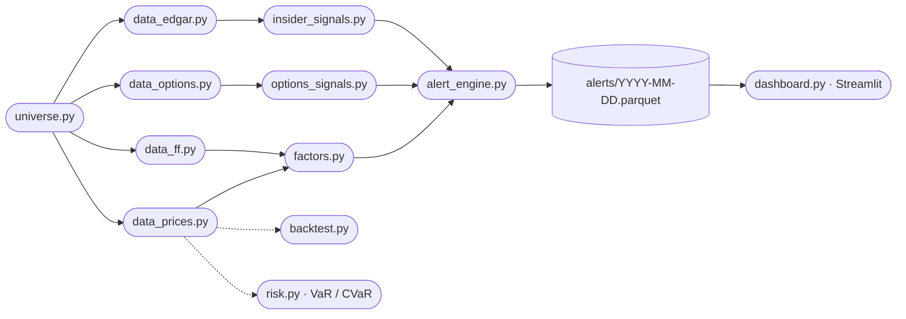

# NDX 100 · Factor × Options × Insider Alert Pipeline

A standalone research tool that scans the NASDAQ 100 every day and flags
tickers where three independent edges — fundamental factors, options flow,
and SEC Form 4 insider transactions — agree on a directional view, plus
a long-only tactical tier based on 3-month momentum.

All data comes from free public sources (yfinance, SEC EDGAR, Ken French
data library). No paid feeds. No portfolio concepts. No cross-dependencies.

## Architecture



Plain-text fallback (ASCII only, aligns in any monospace viewer):

```
universe.py  +--> data_prices.py  --> factors.py --------+
             |                                           |
             +--> data_options.py --> options_signals.py +
             |                                           +--> alert_engine.py --> alerts/YYYY-MM-DD.parquet
             +--> data_edgar.py   --> insider_signals.py +                           |
             |                                           |                           v
             +--> data_ff.py      --> factors.py (FF) ---+                    dashboard.py (Streamlit)

             prices  --> backtest.py
                     --> risk.py (VaR / CVaR)
```

See [workflow-1.png](workflow-1.png) for the original design diagram.
(The "OI vs 20d avg" node shown there is replaced by six live single-snapshot
metrics — see [src/options_signals.py](src/options_signals.py).)

## Quickstart (turnkey — no data fetch required)

The repo ships with a full data snapshot for **2026-04-29** baked in (Form 4
filings, option chains, prices, factor / options / insider panels, alerts).
You can verify and open the dashboard without running the slow first EDGAR
insider pull.

```bash
# 1. Clone the repo
git clone https://github.com/kchung35/ndx-alert-pipeline.git
cd ndx-alert-pipeline

# 2. Create an isolated Python environment (any of these works)
python3 -m venv .venv && source .venv/bin/activate    # macOS / Linux
#   OR on Windows PowerShell:
#   py -m venv .venv ; .venv\Scripts\Activate.ps1

# 3. Install dependencies (Python 3.11 / 3.12 / 3.13)
pip install -r requirements.txt

# 4. Verify the committed baseline snapshot
python3 scripts/verify_snapshot.py --date 2026-04-29

# 5. Open the institutional dashboard — uses the baked-in 2026-04-29 data
streamlit run src/dashboard.py
# -> http://localhost:8501
```

### Turnkey reproducibility

The committed `data/` directory is the reproducibility package, not a private
database. It contains public SEC Form 4 filings, public yfinance snapshots,
Ken French factors, and the pipeline outputs needed to reproduce the shipped
dashboard. The SEC Form 4 cache lives in `data/form4/*.parquet` so a fresh
clone does **not** need to spend an hour rebuilding the insider database.

The manifest at `data/snapshot_manifest.json` records the expected row/file
counts for the canonical `2026-04-29` snapshot. Run this after cloning or
before submitting/pushing:

```bash
python3 scripts/verify_snapshot.py --date 2026-04-29
```

### Optional — refresh for a newer date

To pull fresh data for today:

```bash
# SEC requires a User-Agent with contact info for the EDGAR REST API
export SEC_USER_AGENT="Your Name your@email.com"       # macOS / Linux
#   OR on Windows PowerShell:
#   $env:SEC_USER_AGENT = "Your Name your@email.com"

python3 run_daily.py
```

You can also use the **04 Export newsletter** section in Streamlit as a local
refresh surface. The "Fetch data / rebuild" button runs the same pipeline,
optionally includes incremental EDGAR, and can regenerate `NDX Alert Desk.html`.
The standalone HTML file is browser-only, so its refresh controls copy commands
or open Streamlit; it cannot fetch yfinance/SEC data or write parquet files by
itself.

EDGAR refreshes are incremental by default. The pipeline lists recent Form 4s,
skips accessions already present in `data/form4/{ticker}.parquet`, fetches only
new XML filings, and merges/dedupes them into the cache. To update insiders
only from the committed baseline:

```bash
python3 run_daily.py --skip-universe --skip-prices --skip-options --skip-ff
```

To intentionally re-download cached Form 4 XML for debugging:

```bash
python3 -m src.data_edgar --date 2026-04-29 --force-refetch
```

You can also recompute alerts from the committed panels without network:

```bash
# Same alerts but recomputed (seconds, no network)
python3 -m src.alert_engine --date 2026-04-29
```

## Preview the dashboard without running anything

A static snapshot of the dashboard ships with the repo:
[`NDX Alert Desk.html`](NDX%20Alert%20Desk.html). Double-click the file to
open it in any browser — no Python, no data fetch, no Streamlit.

Use this for:
- a quick look at the design / aesthetic before installing anything
- sharing a screenshot-style demo with the professor or a teammate
- verifying in your browser that fonts and colors render correctly

For the **live** interactive dashboard (real data, drill-down, filters),
run `streamlit run src/dashboard.py` after completing the Quickstart.

## What the alerts mean

The pipeline assigns each of the 100 tickers to one of six tiers:

| Tier | Rule | Recommended action |
|---|---|---|
| `STRONG_BULLISH`     | Composite > +1.5 AND all 3 components > +0.3 | Long 1.0× weight |
| `STRONG_BEARISH`     | Composite < −1.5 AND all 3 components < −0.3 | Short 1.0× weight |
| `MOMENTUM_LONG`      | Top 10% by 3-month momentum z-score | Long 0.75× weight |
| `CONFLUENCE_BULLISH` | Composite > +1.0, ≥2 of 3 components > +0.15, no strong disagreement | Long 0.5× weight |
| `CONFLUENCE_BEARISH` | Composite < −1.0, ≥2 of 3 components < −0.15, no strong disagreement | Short 0.5× weight |
| `NO_ALERT`           | Everything else | Ignore |

**Rebalance monthly. Hold 20 trading days.** See the "Strategy reliability"
section before committing real capital.

## Key CLI entry points

| Command | Purpose |
|---|---|
| `python3 run_daily.py`                           | Full daily pipeline |
| `python3 run_daily.py --date YYYY-MM-DD`         | Re-run for a specific date |
| `python3 run_daily.py --refresh-universe`        | Rebuild NDX constituent cache from Wikipedia |
| `python3 run_daily.py --skip-edgar`              | Skip the slow EDGAR step |
| `python3 -m src.universe`                        | Build universe file only |
| `python3 -m src.data_prices`                     | Pull prices + fundamentals + VIX |
| `python3 -m src.data_options`                    | Snapshot today's option chains |
| `python3 -m src.data_edgar`                      | Pull Form 4 filings |
| `python3 -m src.factors --date YYYY-MM-DD`       | Compute factor panel |
| `python3 -m src.alert_engine --date YYYY-MM-DD`  | Rebuild alerts from existing panels |
| `python3 -m src.backtest --start ... --end ...`  | Factor-only L/S backtest |
| `python3 -m src.risk --date YYYY-MM-DD`          | VaR/CVaR on current alert book |
| `python3 scripts/verify_snapshot.py --date YYYY-MM-DD` | Verify committed reproducibility snapshot |
| `python3 scripts/export_newsletter.py --date YYYY-MM-DD` | Local email newsletter package + `.eml` draft |
| `streamlit run src/dashboard.py`                 | Launch the dashboard |

## Newsletter export

The dashboard can package any alert snapshot into a send-ready local email
draft. In Streamlit, use the **04 Export newsletter** section to generate
`newsletter.html`, `newsletter.txt`, a copied static dashboard HTML file, an
optional PNG dashboard snapshot, and `NDX Alert Snapshot.eml`.

You can also run the exporter from the command line:

```bash
python3 scripts/export_newsletter.py --date 2026-04-29 --no-png
```

Exports are written under `exports/newsletters/` and are ignored by git. The
`.eml` leaves recipients blank and never sends email.

## Tests

```bash
# Unit tests
python3 -m pytest -q -p no:cacheprovider

# Verify the committed turnkey snapshot
python3 scripts/verify_snapshot.py --date 2026-04-29

# 5-year multi-regime backtest validation of MOMENTUM_LONG
python3 tests/validate_momentum_5y.py

# Diagnostic harness — evidence for each of the flagged pipeline issues
python3 tests/diagnose_issues.py
```

## Project layout

```
ndx-alert-pipeline/
├── README.md                         # this file
├── requirements.txt
├── .gitignore
├── run_daily.py                      # daily orchestrator
├── workflow-1.png                    # original architecture diagram
│                                     # (the "OI vs 20d avg" node shown is replaced
│                                     #  by six live single-snapshot metrics — see
│                                     #  src/options_signals.py)
├── NDX Alert Desk.html               # static dashboard preview (real parquet data baked in)
├── src/
│   ├── universe.py                   # NDX 100 constituent resolver (cached + Wikipedia fallback)
│   ├── data_prices.py                # yfinance OHLCV + fundamentals + VIX
│   ├── data_options.py               # yfinance option chain snapshotter
│   ├── data_edgar.py                 # SEC Form 4 fetcher + XML parser (raw REST, no edgartools)
│   ├── data_ff.py                    # Ken French 5-factor daily downloader
│   ├── factors.py                    # momentum (12-1, 3m), value, quality, low-vol, sector-neutralized
│   ├── options_signals.py            # V/OI, IV skew, term structure, flow ratio - the six metrics
│   ├── insider_signals.py            # cluster-weighted insider scoring
│   ├── alert_engine.py               # composite + momentum + confluence tier assignment
│   ├── backtest.py                   # walk-forward L/S backtest on factor composite
│   ├── risk.py                       # VaR / CVaR / Sharpe / drawdown
│   ├── dashboard.py                  # single-page Streamlit dashboard
│   ├── trading_day.py                # NY-timezone-aware last-completed-trading-day helper
│   └── lifted/                       # math + visual primitives (pure, no business logic)
│       ├── analytics.py              # VaR, Sharpe, correlation, max drawdown
│       ├── display.py                # column display name mapping
│       ├── index_universe.py         # CIK-based issuer dedup (GOOG/GOOGL etc.)
│       ├── insider_utils.py          # Form 4 classification + corporate-entity filter
│       ├── sec_identity.py           # SEC ticker -> CIK resolver
│       └── ui_style.py               # "Deep Trading" design tokens + Plotly theme
├── tests/
│   ├── test_*.py                     # unit tests across the modules
│   ├── diagnose_issues.py            # investigate-before-fix diagnostic harness
│   └── validate_momentum_5y.py       # multi-regime backtest validation
└── data/
    ├── README.md                     # committed data / cache notes
    ├── snapshot_manifest.json        # expected counts for the baseline snapshot
    ├── constituents_ndx100.json      # NDX 100 constituents seed (ticker, company, sector)
    ├── market_caps_ndx100.json       # market cap seed (billions)
    ├── sec_company_tickers_cache.json # SEC CIK lookup cache
    └── {generated on first run}/
        ├── prices.parquet
        ├── fundamentals.parquet
        ├── vix.parquet
        ├── ff.parquet
        ├── universe.parquet
        ├── chains/{date}/{ticker}.parquet
        ├── form4/{ticker}.parquet
        ├── factors/{date}.parquet
        ├── options_signals/{date}.parquet
        ├── insider_signals/{date}.parquet
        └── alerts/{date}.parquet
```

## Scope & methodological notes

- **Backtest window**: 2021–2026 (5 years, 60 monthly rebalances) covering
  a bear market (2022), recovery (2023) and two bull regimes (2024–2025).
- **Strategy selection**: the MOMENTUM_LONG tier was chosen after comparing
  several candidates (factor composite, 1-month reversal, 12-1 vs 3-month
  momentum). H1/H2 2025 is the selection window; 2022–2024 serve as
  validation.
- **Regime behavior**: consistent with Jegadeesh-Titman (1993) and the
  "momentum crash" literature (Daniel & Moskowitz 2016), long-only momentum
  underperformed the equal-weight benchmark in 2022 (−34 % vs −25 %).
  A 200-day SMA regime gate is the documented remediation and is listed
  below as a planned extension.
- **Frictions**: transaction costs and bid-ask spreads are not modeled.
  A 3 bps round-trip estimate would compress annualized excess by several
  percentage points while preserving the rank order of strategies tested.
- **Universe**: backtest applies *current* NDX 100 membership to historical
  dates. This introduces a mild survivorship effect; point-in-time
  membership is available from Nasdaq index archives as a follow-on.
- **Composite calibration**: the three-signal composite weights and tier
  thresholds are heuristic. Cross-validated calibration across the 5-year
  window is planned.

## Planned extensions

1. 200-day SMA regime gate on the MOMENTUM_LONG tier
2. Transaction cost model (3 bps round-trip, bid-ask overlay)
3. 10-year backtest covering the 2018–2020 cycle
4. Point-in-time NDX membership from Nasdaq index archives
5. Cross-validated composite weights and tier thresholds

## Design choices & non-goals

- **Parquet-only output layer.** No DB. Everything is a file on disk.
- **SEC raw REST, no edgartools.** The `index.json` + `primary_doc.xml`
  / `edgardoc.xml` probe handles 99% of Form 4 naming conventions.
- **In-process token-bucket rate limiter.** No `/tmp` state files.
- **No portfolio concepts.** The "live book" is the set of currently-open
  alerts, nothing more — no NAV, no holdings, no transactions.
- **Sector-neutralized factor z-scores** with a min-sector-size guard of 5
  (so solo-sector tickers like NDX's lone Real Estate / Basic Materials
  members don't get zeroed out).
- **Institutional UI**: Fraunces serif masthead, IBM Plex Sans body,
  JetBrains Mono for numerics, aged-gold `#E8B84E` accent on a blue-black
  canvas. Single page, three sections, hand-rolled HTML ledger tables.

## License & context

Student research project for ESCP MIM *Coding en Python* (course
2526MIM_PA_FX1D_SPR_A7_OL). Uses only free public data sources. Not
investment advice.
